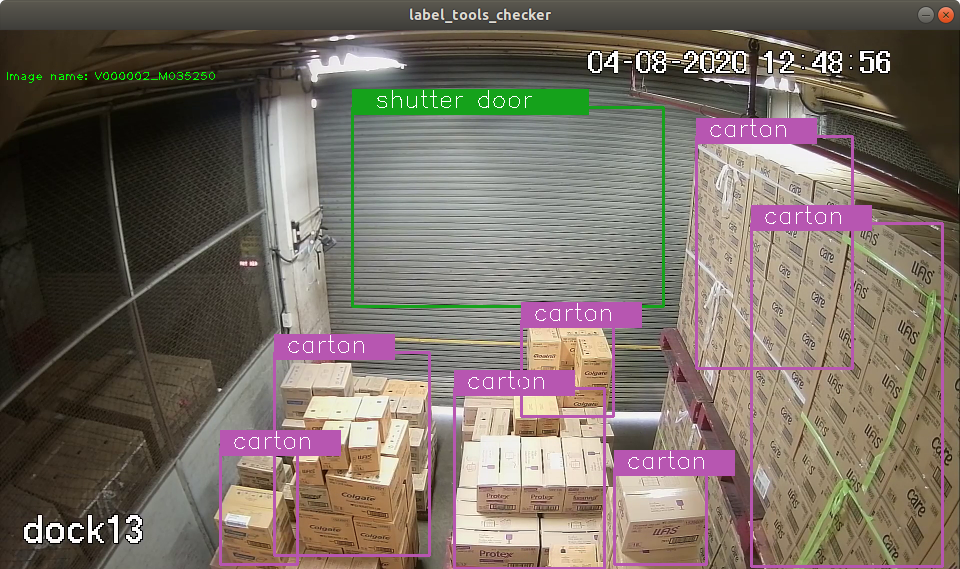

# label_tools_for_darknet
Label tools for image training by YOLO Darknet

# Ex 1: Usage for video label
```
$ cd build
$ cmake ..
$ make
$ ./label_tools_video --config ../config/label_tools_video.yaml
```
Usage guide
* ESC | to quit the software
* q   | to play the next video file
* p   | 'TOGGLE' to play or pause the video
* s   | to set the starting frame No. for video play
* f   | to set the labels on the current image
* a   | to add the labeled box to the database
* d   | to display 'ID' to all labeled boxes
* D   | to delete a labeled box by 'ID'
* r   | to reset polygon position

# Ex 2: Usage for label checker
```
$ cd build
$ cmake ..
$ make
$ ./label_tools_checker --config ../config/label_tools_video.yaml
```
Result

